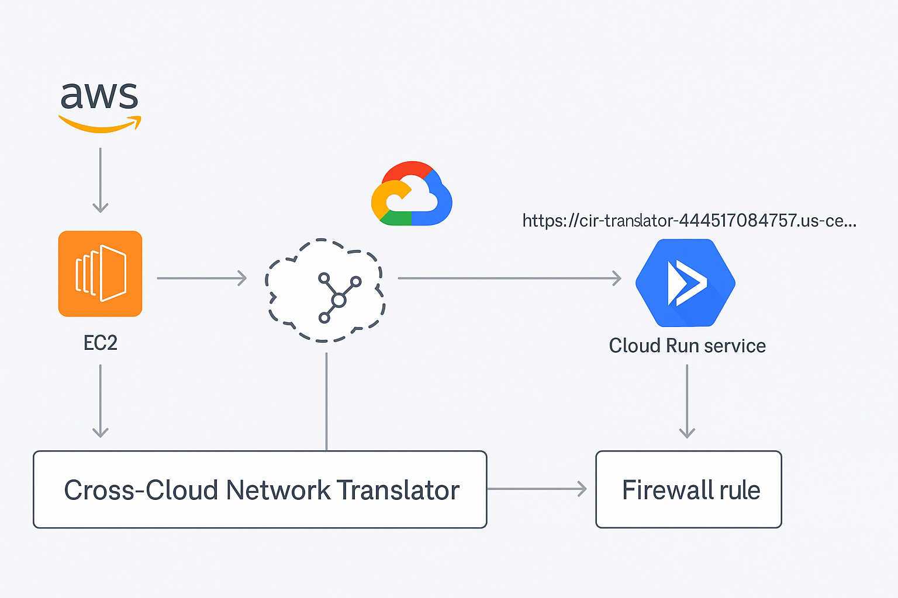
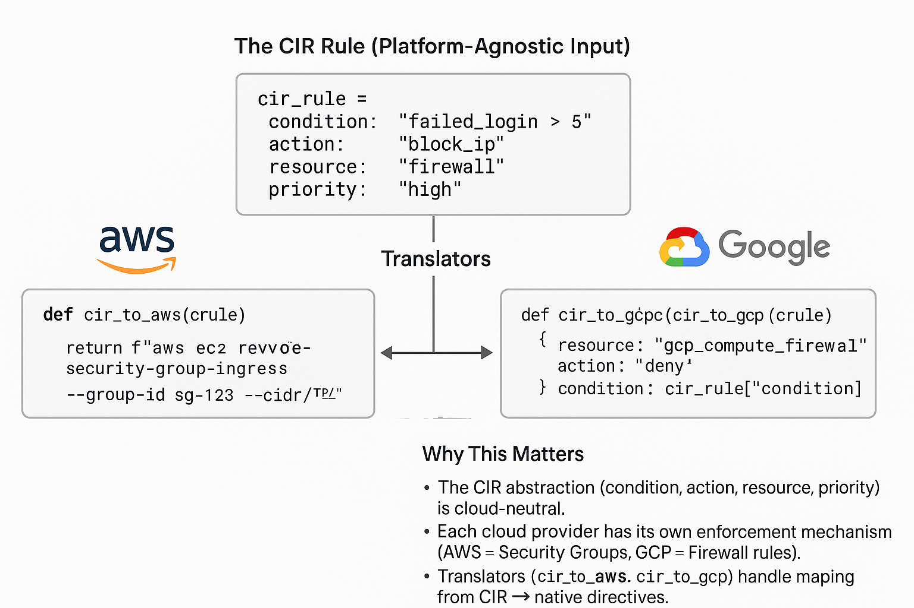

---

## Drop-in fixed README (balanced fences + image paths)

Paste this version over your file (it has all code fences properly closed and uses the renamed image files):

```markdown
# CIR X-Cloud Demo
**Common Intermediate Representation (CIR) for Cross-Cloud Security Translation**

This project implements a **Cross-Cloud Network Translator** that normalizes heterogeneous security directives and events into a **Common Intermediate Representation (CIR)**, and translates them into **target-specific machine-executable actions** across AWS and GCP.

It enables cross-cloud enforcement — for example, ingesting an event in AWS and enforcing it in GCP, or vice versa.

---

## Architecture



**Flow:**
1. Security events are generated in **AWS EC2**.  
2. Events are passed through the **Cross-Cloud Network Translator (CIR engine)**.  
3. CIR is translated into **GCP Cloud Run services**.  
4. The Cloud Run service enforces policies, e.g., creating **Firewall Rules**.

---

## CIR Rule to Cloud-Specific Translation

This example demonstrates how a **CIR rule** can be mapped into **AWS Security Group rules** or **GCP Firewall rules** using translators.



---

## Features
- Normalize heterogeneous policies, directives, detections, and events into CIR.  
- Translate CIR → **Cloud-native enforcement actions** (GCP Firewall, AWS Security Groups, etc.).  
- **Cross-cloud enforcement** (AWS → GCP, GCP → AWS).  
- Simulation / validation harness for safe testing (`dry-run mode`).  
- Capability fallback (if a directive is unsupported, generate nearest valid action).

---

## Tech Stack
- **Languages**: Python, Terraform  
- **Clouds**: AWS, GCP  
- **Services**: GCP Cloud Run, GCP Artifact Registry, AWS EC2  
- **Infrastructure as Code (IaC)**: Terraform  
- **Artifacts**: JSON

---

## Project Structure
```

cir-xcloud-demo/
│── infra/          # Terraform IaC definitions
│── src/            # Python app source code
│── scripts/        # Utility & cleanup scripts
│── images/         # Architecture diagrams & assets
│── Makefile        # Build automation
│── README.md       # Project documentation (this file)
│── .gitignore      # Ignore unnecessary files (Terraform, Python, IDE, OS)

````

---

## Setup & Installation

### 1) Clone the repo
```powershell
git clone https://github.com/AminPasha7/cir-xcloud-demo.git
cd cir-xcloud-demo
````

### 2) Setup Python environment

```powershell
python -m venv .venv
.venv\Scripts\activate
pip install -r requirements.txt
```

### 3) Setup Terraform

```powershell
cd infra
terraform init
terraform plan
terraform apply
```

### 4) Deploy Cloud Run service

```powershell
gcloud run deploy cir-translator `
  --source . `
  --region us-central1 `
  --platform managed `
  --allow-unauthenticated
```

### Usage Example

```powershell
$body = @'
{
  "version":"0.1",
  "id":"demo-allow-ssh",
  "mode":"dry-run",
  "conditions":{"event.type":"demo.trigger"},
  "action":"allow_ingress",
  "resources":{"gcp":{"vpc":"default","tag":"cir-demo","cidr":"10.10.0.0/16","port":22}}
}
'@

Invoke-WebRequest `
  -Uri "https://<cloud-run-url>/simulate" `
  -Method POST `
  -Body $body `
  -ContentType "application/json"
```

**Response**

```json
{
  "ok": true,
  "plan": {
    "would_create_rule": "cir-demo-allow-ssh-22",
    "project": null
  }
}
```

---

## Testing

Python unit tests (pytest).

Terraform validation:

```bash
terraform validate
terraform fmt -check
```

---

## License

This project is licensed under the MIT License.
Feel free to use, modify, and distribute under the same license.

---

